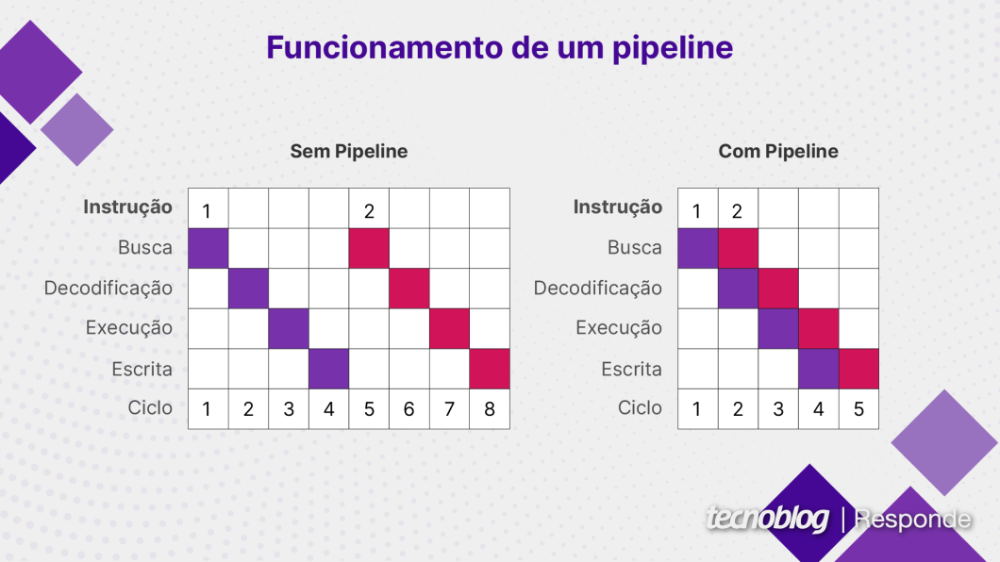

# Arquitetura e Organização de Computadores

## Memória Virtual / Virtualização
**Pipeline:** Método usado para executar várias instruções ao mesmo tempo, dividindo uma tarefa em partes menores que podem ser processadas simultaneamente.
- Processamento paralelo
- Melhora o desempenho do sistema

---

**Memória RAM:** Também chamada de *memória principal*, é conectada diretamente ou indiretamente ao processador através de um *barramento de memória*.

**Barramento de memória:** É constituido por um *barramento de endereço* e um *barramento de dados*

---

**Processador e memória:**

O processador envia um *endereço de memória*, que indica a posição dos dados na memória, através do *barramento de endereço*.

Então o processador lê ou escreve os dados do *barramento de dados*.

Também pode haver uma UGM (Unidade de Gerência de Memória, MMU - Memory Management Unit) que é um dispositivo colocado entre o processador e a memória RAM. A Unidade de Gerência de Memória calcula o endereço real da memória quando é usada uma abstração de memória virtual.

---

**Memória Virtual:**

